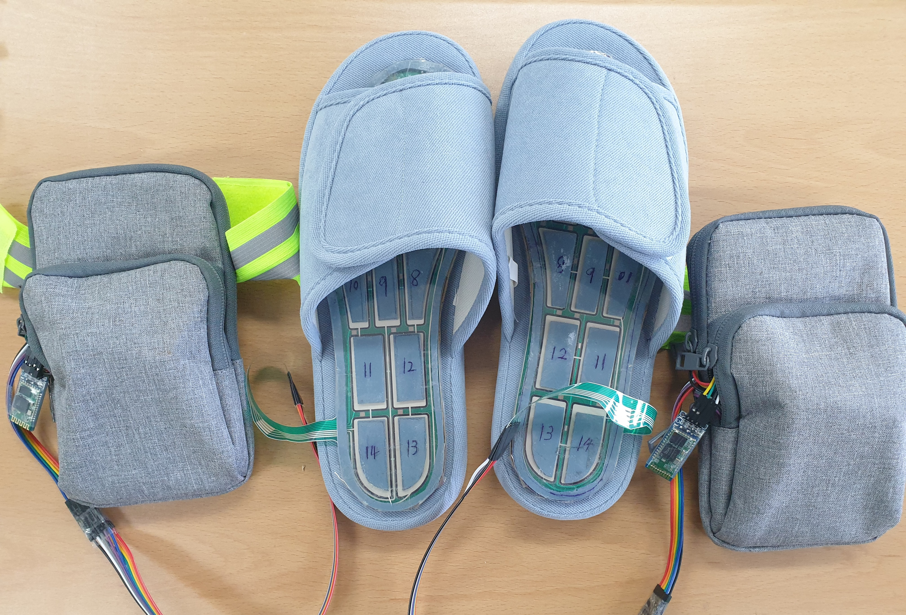
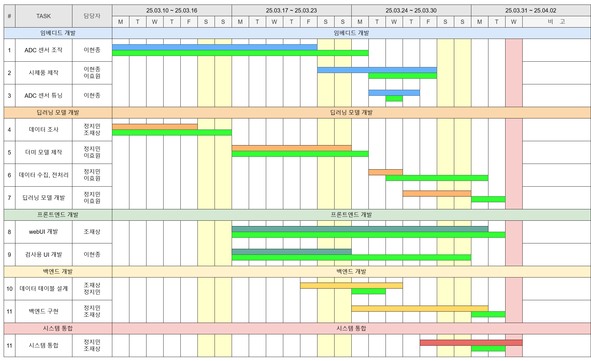

# 250402_intel-AISW_WalkScan-System

인텔 AISW 아카데미 메인 프로젝트 3조 신나게 걷는 도비 팀 WalkScan System 프로젝트의 AI 모델 학습 파트입니다.




<br/>

데이터 전처리 및 모델학습, 간단한 GUI 구현을 다루는 문서로,

전체적인 내용을 확인하려면 아래 링크로 이동해주시기 바랍니다.

> https://github.com/jo5862/intel03_team3_foot.git

<br/>

## 라이선스 (License)

이 저장소에 포함된 데이터(`data/` 디렉토리)는  
[Creative Commons Attribution 4.0 International (CC BY 4.0)](https://creativecommons.org/licenses/by/4.0/) 라이선스를 따릅니다.

사용자는 **출처를 표시하는 조건** 하에 자유롭게 데이터를 복제, 수정, 배포, 활용할 수 있습니다.  
상업적 이용과 2차 저작물 생성도 허용됩니다.

> 모든 개인식별 정보는 제거되었으며, 연구 및 교육 목적의 공개를 위한 비식별화가 완료되었습니다.

<br/>

## 간트 차트



<br/>

## 파트별 README 바로가기

### DATA

직접 수집한 데이터에 관한 README 입니다.

[데이터_설명_바로가기](https://github.com/chipmunk-tail/250402_intel-AISW_Dobby-walking-happily-AI_Part/blob/main/data)

### DATA_Preprocessing

데이터 전처리에 관한 README 입니다.

[데이터_전처리_설명_바로가기](https://github.com/chipmunk-tail/250402_intel-AISW_Dobby-walking-happily-AI_Part/tree/main/model_learning/basic_preprocessing)

### CRNN_Model_leraning

1차 모델 학습 - CRNN 모델 학습에 관한 README 입니다.

[CRNN_모델학습_설명_바로가기](https://github.com/chipmunk-tail/250402_intel-AISW_Dobby-walking-happily-AI_Part/tree/main/model_learning/CRNN)

### RNN_Model_leraning

2차 모델 학습 - RNN 모델 학습에 관한 README 입니다.

[RNN_모델학습_설명_바로가기](https://github.com/chipmunk-tail/250402_intel-AISW_Dobby-walking-happily-AI_Part/tree/main/model_learning/RNN)

<br/>

## 디렉토리 구조

```
./intel-AISW_WalkScan-System/
├── backend/
│   ├── __init__.py            
│   ├── backend.py      
│   └── model.py                       
├── data/ 
│   ├── raw_data/
│   │   ├── normal/      
│   │   └── right_weight/     
│   └── README.md 
├── file/ 
│   └── 
├── model_learning/   
│   ├── basic_preprocessing/
│   │   ├── 01_data_spride_cutting.py     
│   │   ├── 02_data_visualize.py      
│   │   ├── 03_split_train_val_test.py      
│   │   └── README.md   
│   ├── CRNN/ 
│   │   ├── 01_CRNN_preprocessing.py     
│   │   ├── 02_CRNN_learning.py      
│   │   └── README.md        
│   └── RNN/
│   │   ├── 01_RNN_preprocessing.py     
│   │   ├── 02_RNN_learning.py      
│   │   ├── 03_confusion_matrix.py      
│   │   └── README.md   
├── src_img/   
├── LICENSE
├── README.md                           <= 현재 문서
├── requirements.txt
└── UI_APP.py
```


## UI


