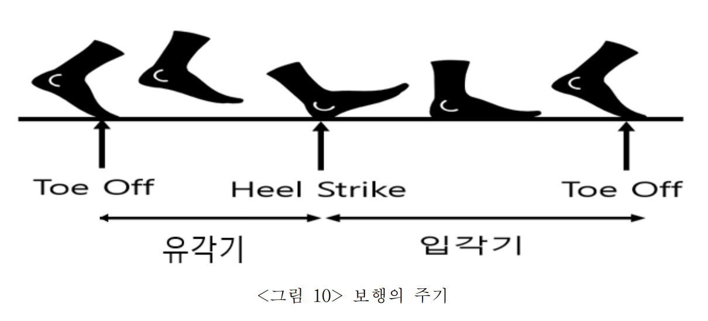
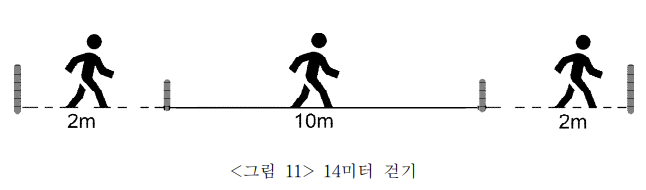

# 데이터 전처리 과정

14개의 FSR 센서로 이루어진 RX-ES39A에서 받은 데이터를 모델에 학습시킬 수 있도록 전처리를 진행하는 단계입니다.

 

## 데이터 구간 선정

센서에서 데이터를 받아 저장하면 아래와 같은 형태이다.

 

이것을 양발 데이터의 합을 평균내서 시간축에 그래프를 그리면 아래와 같이 그래프가 출력된다.

 

걸음걸이 구간에서 연속된 패턴이 보인다.

이 연속된 데이터를 모델에 넣기 위해서 균일한 단위로 잘라야 한다.

참고자료 :

[학위논문] 족저압을 이용한 보행 밸런스 분석Analysis of Gait balance using Plantar Pressure - 이명재 - 9p
https://scienceon.kisti.re.kr/srch/selectPORSrchArticle.do?cn=DIKO0015549935#;

 

위 논문에선 이 프로젝트와 유사한 프로젝트를 진행했는데,

걸음의 구간을 나누는 걸 'Heel Strike'를 기준으로 데이터 구간을 나누었다.

     

위 기준을 따라 구간을 정해서 그래프로 출력하면

위 모습과 같이 패턴단위로 데이터를 자를 수 있게 되었다.

 

## 데이터 전처리

모델 학습을 위해 데이터를 나눠 패턴으로 자르는 구간이다.

 

### 가속, 감속 구간 제거

위 데이터를 보면 일정하게 걷는 구간만 존재하는게 아니라 멈추거나, 가속, 감속 구간이 존재한다.

위 논문에서 자르는 기준으로 앞과 뒤의 가속, 감속 구간의 데이터를 제외했다.

 

### 결측치 제거

위와 같이 nan값이 있는 데이터는 제거한다.

 

### 센서 튐 제거

센서값이 튀어서 패턴 이외의 모습을 보여주는 데이터는 제거한다.

 

## 데이터 split

scikit-learn을 이용해서 train : val : test => 8 : 1 : 로 나누었다.

 

**normal**

- 전체 파일 개수: 573
- 훈련(train) 파일 개수: 458
- 검증(val) 파일 개수: 57
- 테스트(test) 파일 개수: 58

**Right_weight**

- 전체 파일 개수: 563
- 훈련(train) 파일 개수: 450
- 검증(val) 파일 개수: 56
- 테스트(test) 파일 개수: 57

